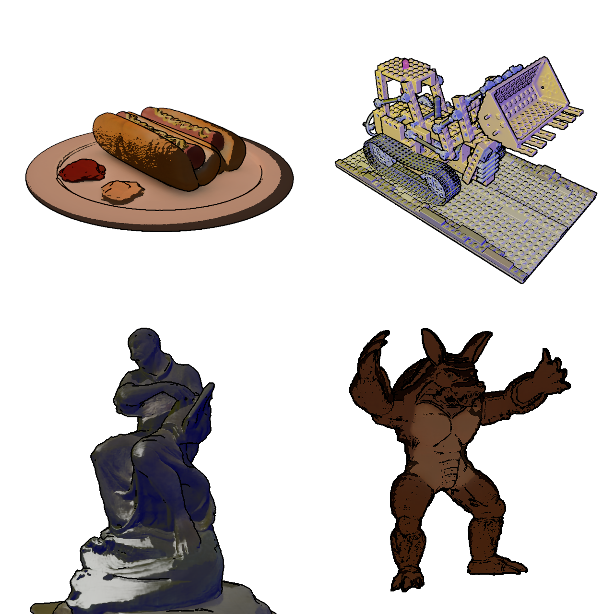

# Non-Photorealistic Novel View Synthesis Using Radiance Fields

## [Project Page](https://mszilvasy.github.io/TensoIR-NPR/) |  [Paper](http://resolver.tudelft.nl/uuid:d64b7da6-e681-4a5c-9d2a-fa68e02df4e2)

Repository containing the code used in my thesis, Non-Photorealistic Novel View Synthesis Using Radiance Fields.



This implementation is based on [TensoIR](https://github.com/Haian-Jin/TensoIR). Please refer to their repository for installation instructions.

## Dataset

* [TensoIR-Synthetic](https://zenodo.org/record/7880113#.ZE68FHZBz18)
* [Tanks&Temples](https://dl.fbaipublicfiles.com/nsvf/dataset/TanksAndTemple.zip) 
* [Environment Maps](https://drive.google.com/file/d/10WLc4zk2idf4xGb6nPL43OXTTHvAXSR3/view?usp=share_link)

See [TensoIR](https://github.com/Haian-Jin/TensoIR) and [TensoRF](https://github.com/apchenstu/TensoRF) for more datasets and instructions on how to prepare your own.

## Training

Use `train_tensoIR.py`, `train_tensoIR_rotated_multi_lights.py` or `train_tensoIR_general_multi_lights.py` for the synthetic datasets (refer to the TensoIR repository for more information):

```bash
export PYTHONPATH=. && python train_tensoIR_rotated_multi_lights.py  --config ./configs/multi_light_rotated/hotdog.txt
```

Use `train_tensoIR_simple.py` for Tanks and Temples:

```bash
export PYTHONPATH=. && python train_tensoIR_simple.py  --config ./configs/tanks_and_temples/ignatius.txt
```

## Rendering

You can render a pre-trained model with `scripts/npr.py`:

```bash
export PYTHONPATH=. && python scripts/npr.py --ckpt path/to/your/ckpt --config configs/npr/lego.txt
```

To run just the silhouette edge detection algorithm mentioned in the paper, and see a video of the process, use `edge_detection/scan_edges.py`:

```bash
export PYTHONPATH=. && python edge_detection/scan_edges.py --ckpt path/to/your/ckpt --config configs/edges/hotdog.txt
```

In either case, you can set the `--frame_index` flag, in either the config file or the console, to render a specific frame from the dataset. Results are stored in `--geo_buffer_path`, defined in the config file.
